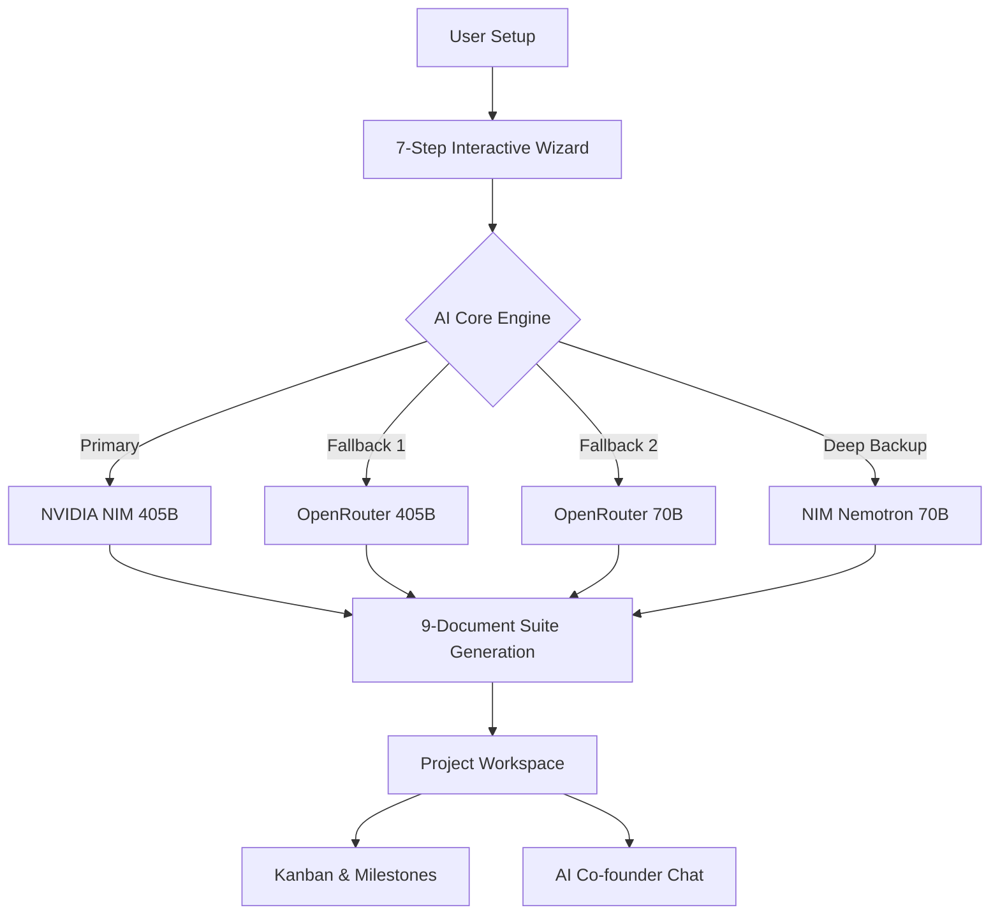

# 🚀 SwiftDocs AI v2.1 — AI-Powered Documentation SaaS

**SwiftDocs AI** is a cutting-edge SaaS platform designed to bridge the gap between startup ideas and professional, production-ready technical documentation. By answering a series of business-centric questions, users can generate a complete 9-document technical suite in seconds.

---

## 🏗️ System Architecture & Workflow

### 🔄 How it Works
The platform follows a **7-Step Wizard** logic to extract the core essence of a project and translate it into clinical technical requirements.

### 🛰️ Tech Stack
| Layer | Technologies |
| :--- | :--- |
| **Frontend** | React 18, Vite 5, Tailwind CSS, Zustand, Framer Motion |
| **Backend** | Node.js v20, Express.js v4, PM2 (Cluster Mode) |
| **Database** | MongoDB Atlas, Mongoose v8 (Strict Schema & Compound Indexing) |
| **Auth** | JWT + httpOnly Refresh Token Rotation, Google OAuth 2.0 |
| **AI Layer** | NVIDIA NIM, OpenRouter (Cascading Fallback Architecture) |
| **Payments** | Stripe (Checkout, Subscriptions, Webhooks) |

---

## 📁 9-Document Technical Suite
Our AI generates a comprehensive set of documents that are not just for humans, but also optimized for **AI Coding Agents** (Claude/Cursor):

1.  **📊 Clinical PRD**: Business vision, features, and user stories.
2.  **⚙️ SRD (Software Requirements)**: Modular architecture and API contracts.
3.  **🔧 Tech Stack**: AI-driven tool recommendations.
4.  **🗄️ DB Schema**: Detailed Mongoose models & relationships.
5.  **🔄 User Flows**: Visual/Step-by-step logic maps.
6.  **🚀 MVP Plan**: Phased development roadmap.
7.  **📂 Folder Structure**: Clean architecture directory maps.
8.  **🤖 CLAUDE.md**: Master guide for AI coding agents.
9.  **💬 System Prompts**: Specialized prompts for development tasks.

---

## 🛠️ Development & Features
- **Interactive Wizard**: Step 0 project type selection (SaaS, Mobile, AI, etc.).
- **Smart Workspace**: Kanban board for feature tracking and milestone management.
- **AI Co-founder**: A persistent chatbot with full project context.
- **Security First**: Stateless JWT auth with secure cookie rotation for maximum protection.

---

## 👨‍💻 Developed By
**Muhammad Sameer**  
*Full Stack Developer & AI Specialist*

- 🌐 [LinkedIn Profile](https://www.linkedin.com/in/sameer-akram-52662a28a/)
- 📧 [Email Me](mailto:sameerdevexpert@gmail.com)

---

## 📈 Roadmap & Updates
As the project progresses through **Phase 2 (Workspace Expansion)** and **Phase 3 (Scaling)**, this README will be updated to reflect:
- ✅ **Complete**: Core 9-doc generation pipeline.
- 🚧 **In Progress**: Smart Kanban & Milestone integration.
- 📅 **Planned**: Direct export to GitHub & Team collaboration.

---
*Generated by SwiftDocs AI v2.1 — Built for the builders of tomorrow.*
