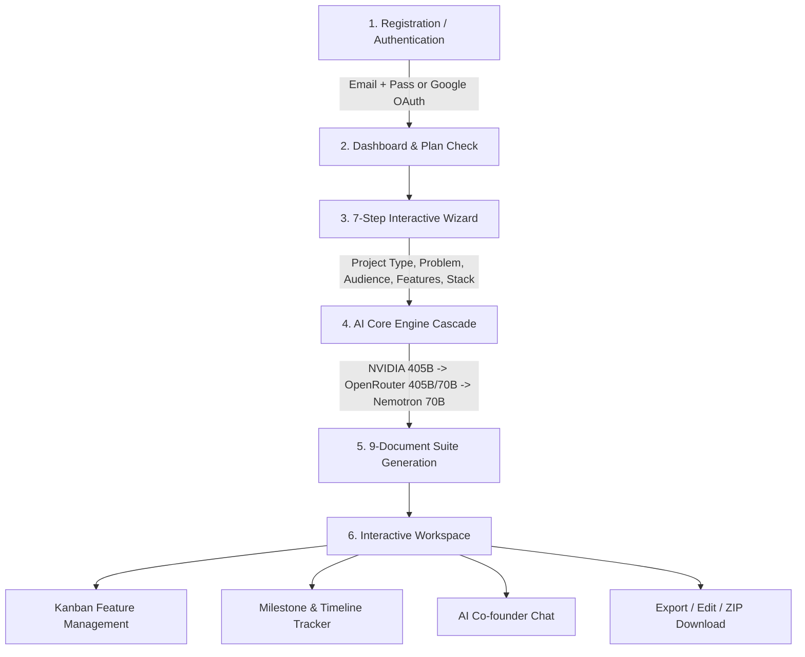

# 🚀 ClarifyAI (AiDocs) — AI-Powered Documentation SaaS

ClarifyAI (AiDocs) is an AI-powered SaaS platform designed to bridge the gap between startup ideas and professional, production-ready technical documentation. By guiding users through an interactive 7-step business wizard, ClarifyAI automatically translates non-technical ideas into a complete **9-document technical suite** optimized for developers and AI Coding Agents (such as Claude Code, Cursor, and Antigravity).

---

## 💡 Core Vision & Problem Solved

Non-technical founders, students, and early-stage entrepreneurs often struggle to express technical specifications, leading to miscommunication, delayed execution, and software project failure. ClarifyAI solves this by:

- **Translating Business Intent to Technical Specs**: Asking plain-English business questions and generating clinical, production-ready documentation.
- **AI-Agent Optimization**: Generating documents specifically formatted for LLM coding context (`CLAUDE.md`, system prompts, Mongoose DB schemas, and API contracts).
- **Interactive Workspace**: Providing Kanban feature boards, milestone timelines, document editing, and an AI Co-founder context chat.

---

## 🔄 Complete User Flow


```mermaid
graph TD
    A[1. Registration / Authentication] -->|Email + Pass or Google OAuth| B[2. Dashboard & Plan Check]
    B --> C[3. 7-Step Interactive Wizard]
    C -->|Project Type, Problem, Audience, Features, Stack| D[4. AI Core Engine Cascade]
    D -->|NVIDIA 405B -> OpenRouter 405B/70B -> Nemotron 70B| E[5. 9-Document Suite Generation]
    E --> F[6. Interactive Workspace]
    F --> G[Kanban Feature Management]
    F --> H[Milestone & Timeline Tracker]
    F --> I[AI Co-founder Chat]
    F --> J[Export / Edit / ZIP Download]
```

### Detailed Step-by-Step Experience
1. **User Authentication**: User signs up or logs in via email/password or Google OAuth 2.0. JWT Access Token (15 min) and `httpOnly` Refresh Token (7 days) are issued.
2. **Project Wizard Initiation**: User clicks "New Project" and selects project category (SaaS, Mobile, AI App, E-Commerce, Marketplace, etc.).
3. **Interactive 7-Step Input**:
   - **Step 0**: Category & Project Title
   - **Step 1**: Problem Statement (min 20 chars)
   - **Step 2**: Target Audience & Personas
   - **Step 3**: Core Features (1-10 items)
   - **Step 4**: Primary Business Goals & KPIs
   - **Step 5**: Tech Preferences & Constraints
   - **Step 6**: Development Timeline & Scope
4. **AI Generation Cascade**: Request triggers backend AI service with 4-level fail-safe cascade (NVIDIA NIM 405B → OpenRouter 405B → OpenRouter 70B → NVIDIA Nemotron 70B).
5. **9-Document Generation**:
   - **Clinical PRD** (Product Requirement Document)
   - **Software Requirements (SRD)** (System Modules & API contracts)
   - **Tech Stack Recommendations**
   - **Database Schema** (Mongoose models & relationships)
   - **User Flows** (Logic maps)
   - **MVP Development Plan**
   - **Folder Architecture**
   - **CLAUDE.md** (AI Coding Agent instructions)
   - **System Prompts** (LLM prompt suite)
6. **Project Workspace**: User manages Kanban tasks, tracks milestones, chats with AI Co-founder using project context, edits docs, or exports full project packages.

---

## 🛠️ Technical Stack & Architecture

| Layer | Technology |
| :--- | :--- |
| **Frontend** | React 18, Vite 5, Tailwind CSS, Zustand, Framer Motion |
| **Design System** | Soft UI Neumorphism (`#E0E5EC`, dual RGBA physics shadows) |
| **Backend** | Node.js v20 LTS, Express.js v4, PM2 |
| **Database** | MongoDB Atlas, Mongoose v8 (Compound Indexes) |
| **Authentication** | JWT Bearer, HTTP-Only Cookie Refresh Rotation, Google OAuth 2.0 |
| **AI Layer** | NVIDIA NIM API, OpenRouter API (4-tier fallback cascade) |
| **Payments** | Stripe SDK (Checkout, Webhook Handlers, Downgrade Logic) |

---

## ⚙️ Key Platform Features

- **7-Step Interactive Wizard**: Guided project onboarding with smart validation.
- **Fail-Safe AI Cascade**: 100% generation reliability using multi-provider fallback.
- **Neumorphism Design**: Theme with custom raised/inset RGBA shadows (`#E0E5EC`).
- **Smart Workspace**: Integrated Kanban board linked directly to PRD user stories.
- **AI Co-founder Chat**: Grounded RAG chat leveraging full project context documents.
- **ZIP Export & AI Prompts**: Download full markdown suites or `CLAUDE.md` context files.
- **Subscription Tiering**: Free (3 projects) vs Pro (unlimited + ZIP export + doc editing).

---

## 🚀 Quick Start Guide

### Prerequisites
- Node.js v20+
- MongoDB instance (local or Atlas)
- NPM

### 1. Clone & Install Dependencies
```bash
git clone https://github.com/Konete326/AiDocs.git
cd Clarifyai

cd backend
npm install

cd ../frontend
npm install
```

### 2. Environment Configuration
Create `.env` files in both `backend` and `frontend` directories based on `.env.example`.

### 3. Run Development Servers
```bash
# Backend (Terminal 1)
cd backend
npm run dev

# Frontend (Terminal 2)
cd frontend
npm run dev
```

---

## 📄 License
MIT License. Built for the builders of tomorrow.
